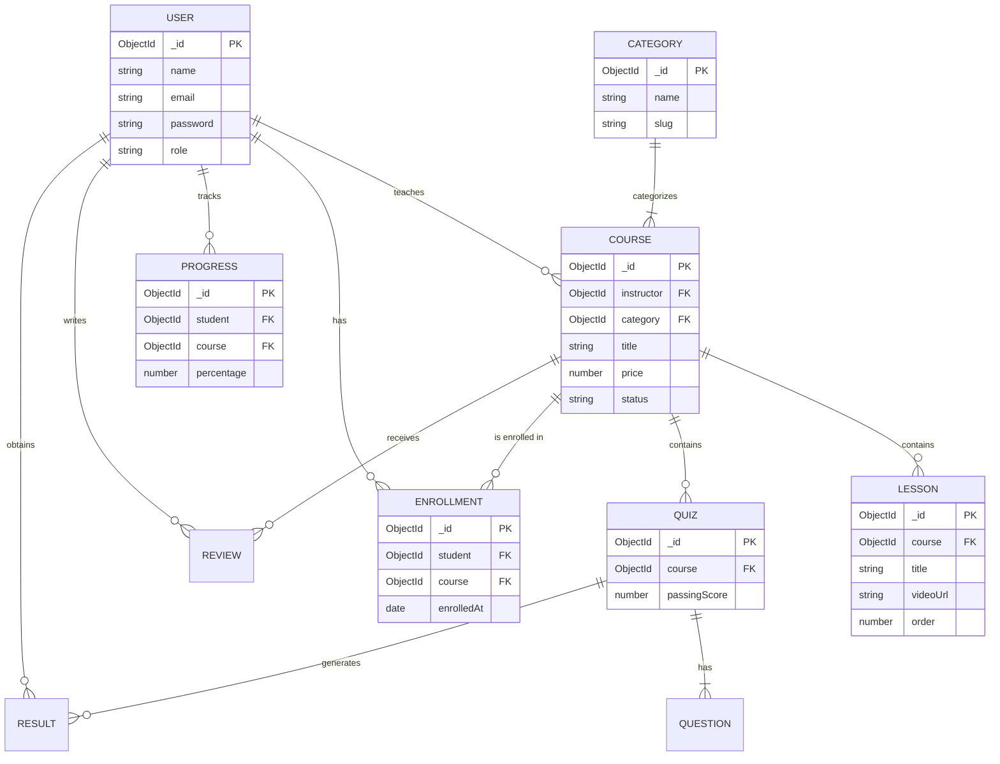

# Tài Liệu Đặc Tả Yêu Cầu & Thiết Kế Hệ Thống E-Learning (MERN Stack)

## 1. Mở Đầu (SRS - Software Requirements Specification)

Hệ thống E-Learning cung cấp nền tảng học trực tuyến toàn diện, cho phép giáo viên tạo và bán các khóa học, còn học viên có thể mua, học, và theo dõi tiến độ của mình. Hệ thống cung cấp trải nghiệm học tập qua video, tài liệu, bài tập trắc nghiệm và hỗ trợ cấp chứng chỉ sau khi hoàn thành.

## 2. Danh Sách Chức Năng (Features List)

### 2.1. Quản Trị Viên (Admin)
- **Quản lý người dùng**: Quản lý tài khoản, phân quyền (Admin, Teacher, Student), khóa/mở khóa tài khoản.
- **Quản lý hệ thống**: Quản lý danh mục (Categories), phê duyệt khóa học do giáo viên tải lên.
- **Quản lý tài chính**: Thống kê doanh thu, tỷ lệ ăn chia, lịch sử giao dịch.
- **Báo cáo & Phân tích**: Xem số liệu tổng quan về số người dùng, số khóa học, top khóa học bán chạy.

### 2.2. Giảng Viên (Teacher)
- **Quản lý khóa học**: Thêm, sửa, xóa, xuất bản, ẩn khóa học.
- **Quản lý bài giảng**: Tải lên video bài giảng, tài liệu đính kèm (PDF, Word).
- **Quản lý kiểm tra (Quiz)**: Tạo bài kiểm tra trắc nghiệm, thiết lập điểm chuẩn qua bài.
- **Tương tác học viên**: Chat, giải đáp thắc mắc, quản lý bình luận.
- **Quản lý thu nhập**: Xem doanh thu cá nhân, yêu cầu rút tiền.

### 2.3. Học Viên (Student)
- **Khám phá & Tìm kiếm**: Tìm kiếm khóa học theo danh mục, từ khóa, lọc theo giá, đánh giá.
- **Học tập**: Xem video, tải tài liệu, theo dõi tiến độ (Progress bar).
- **Kiểm tra & Chứng chỉ**: Làm bài test, nhận điểm và tự động nhận chứng chỉ (PDF) khi hoàn thành.
- **Tương tác**: Đánh giá (Rate/Review) khóa học, chat với giáo viên.
- **Thanh toán**: Mua khóa học an toàn qua các cổng thanh toán.

## 3. Sơ Đồ Use Case (Mermaid)

```mermaid
usecaseDiagram
    actor Admin
    actor Teacher
    actor Student

    package MERN-E-Learning {
        usecase "Đăng nhập / Đăng ký" as UC1
        usecase "Quản lý Profile" as UC2
        
        usecase "Duyệt Khóa Học" as UC_Admin1
        usecase "Quản lý Danh mục" as UC_Admin2
        usecase "Xem Thống kê Hệ thống" as UC_Admin3
        
        usecase "Tạo/Sửa Khóa Học" as UC_Teacher1
        usecase "Upload Video/Tài liệu" as UC_Teacher2
        usecase "Tạo Bài Test" as UC_Teacher3
        usecase "Xem Doanh Thu" as UC_Teacher4
        
        usecase "Tìm Kiếm & Lọc Khóa Học" as UC_Student1
        usecase "Mua Khóa Học" as UC_Student2
        usecase "Học Bài (Xem Video)" as UC_Student3
        usecase "Làm Bài Test" as UC_Student4
        usecase "Nhận Chứng Chỉ" as UC_Student5
        usecase "Đánh Giá Khóa Học" as UC_Student6
    }

    Admin --> UC1
    Admin --> UC2
    Admin --> UC_Admin1
    Admin --> UC_Admin2
    Admin --> UC_Admin3

    Teacher --> UC1
    Teacher --> UC2
    Teacher --> UC_Teacher1
    Teacher --> UC_Teacher2
    Teacher --> UC_Teacher3
    Teacher --> UC_Teacher4

    Student --> UC1
    Student --> UC2
    Student --> UC_Student1
    Student --> UC_Student2
    Student --> UC_Student3
    Student --> UC_Student4
    Student --> UC_Student5
    Student --> UC_Student6
```

## 4. Kiến Trúc Hệ Thống (System Architecture)

- **Frontend**: ReactJS (Single Page Application), Context API / Redux (State Management), TailwindCSS / Material-UI (UI Library).
- **Backend**: NodeJS, ExpressJS (RESTful API), JWT (Authentication), Bcrypt (Password Hashing).
- **Database**: MongoDB, Mongoose ODM (Data Modeling).
- **Storage**: Cloudinary (hoặc AWS S3) để lưu trữ hình ảnh, video bài giảng, file PDF.
- **Thanh toán**: Tích hợp Stripe hoặc VNPay.

## 5. Sơ Đồ ERD (Entity Relationship Diagram)



## 6. Danh Sách Collection MongoDB

1. **Users**: Lưu thông tin người dùng (id, name, email, password, role, avatar).
2. **Categories**: Phân loại khóa học (id, name, slug, description).
3. **Courses**: Lưu thông tin khóa học (title, description, price, instructor_id, category_id, status).
4. **Lessons**: Chứa video và nội dung bài học, liên kết với khóa học (course_id, title, videoUrl, order).
5. **Enrollments**: Quản lý học viên đã mua và đăng ký khóa học nào (student_id, course_id, paymentStatus).
6. **Quizzes**: Bài test cuối khóa hoặc theo từng phần (course_id, title, passingScore).
7. **Questions**: Các câu hỏi thuộc về một Quiz (quiz_id, text, options, correctAnswer).
8. **Results**: Lưu kết quả thi của học viên (student_id, quiz_id, score, isPassed).
9. **Progresses**: Theo dõi tiến độ học tập (student_id, course_id, completedLessons, progressPercentage).
10. **Reviews**: Đánh giá khóa học từ học viên (student_id, course_id, rating, comment).

## 7. Danh Sách REST API Cơ Bản

### Auth & Users
- `POST /api/auth/register` - Đăng ký tài khoản.
- `POST /api/auth/login` - Đăng nhập, cấp JWT.
- `GET /api/users/profile` - Lấy profile cá nhân (Yêu cầu JWT).
- `PUT /api/users/profile` - Cập nhật profile.

### Categories
- `GET /api/categories` - Lấy danh sách danh mục (Public).
- `POST /api/categories` - Thêm danh mục mới (Admin).

### Courses
- `GET /api/courses` - Lấy danh sách khóa học (Public, có phân trang, filter).
- `GET /api/courses/:id` - Lấy thông tin chi tiết 1 khóa học (Public).
- `POST /api/courses` - Tạo khóa học mới (Teacher).
- `PUT /api/courses/:id` - Cập nhật khóa học (Teacher).
- `POST /api/courses/:id/enroll` - Mua/Đăng ký khóa học (Student).

### Lessons & Progress
- `GET /api/courses/:id/lessons` - Lấy danh sách bài giảng (Phải enrolled).
- `POST /api/courses/:id/lessons` - Thêm bài giảng vào khóa học (Teacher).
- `PUT /api/progress/:courseId` - Cập nhật tiến độ khi học viên xem xong 1 bài (Student).

### Quizzes & Reviews
- `GET /api/quizzes/course/:courseId` - Lấy bài test của khóa học.
- `POST /api/quizzes/:quizId/submit` - Nộp bài thi và chấm điểm tự động.
- `POST /api/courses/:id/reviews` - Đánh giá khóa học (Student đã mua).
